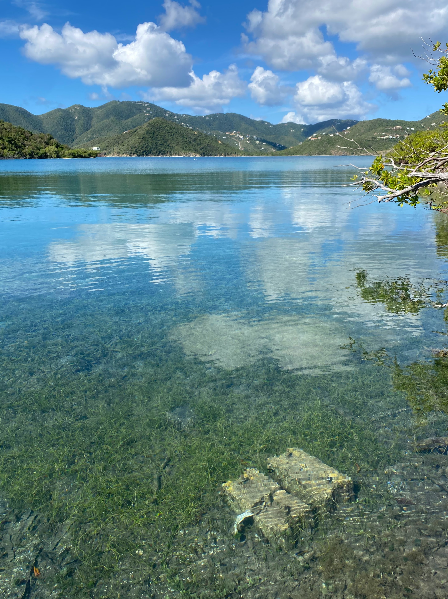

```{r setup, include=FALSE}
knitr::opts_chunk$set(echo = TRUE)
```

# Lilas Thesis Webpage {.tabset}

## Introduction

## Methods

*Survey Design*

In Hurricane Hole, Water Creek and Otter Creek were selected as study sites since these two bays historically had a greater abundance of mangrove-coral habitat than Princess Bay.
Six plots were strategically selected within each bay.
Since the 2017 storms, Hurricane Hole has become composed of a "patchy" mangrove coastline where living, shaded areas of adult red mangrove fringe still extend of the water's edge (Figure 1) and open, nonliving woody debris zones of shoreline remain predominantly unvegetated as a result of storm damage (herein called fringe and debris plots, respectively [Figure 2]).




Plots were strategically selected so that three plots represented fringing areas and three plots represent debris areas within each creek (Figure 4).
Each plot contained a coral recruitment array installed for one full year, one removable transect used to record mangrove habitat and mangrove seedling abundance, and one removable quadrat (1m wide by 2m long) to capture benthic cover and coral abundance.

*Mangrove Community Composition and Seedling Regeneration*

A 2m wide belt transect was used to quantify mangrove community composition and mangrove seedling natural regeneration in each plot.
Transects ran perpendicular to the shoreline, where 0m occurred at the most water-ward mangrove fringe or debris section of the plot.
<br><br> Transects ran from the 0m mark inland until the transect met the last mangrove fringe or mangrove debris habitat on the terrestrial side of the transect.
Due to the variability in length of mangrove habitat along the terrestrial edge of the shoreline, each transect differed in length across all plots.
<br><br> Mangrove seedling natural regeneration was captured quarterly for one year (November 2022 to November 2023).
Within each 2m belt transect, all R.
mangle seedlings (\<50 cm) were tagged using a U-stake and cattle tag then characterized for height, leaf number, health, signs of herbivory, hypocotyl color, and water depth.
Seedlings were accessed on foot or using snorkel as needed, to avoid disturbing any corals found in shallow areas of R.
mangle prop roots.
GPS coordinates for each seedling were taken and a hand-drawn diagram of seedling location was created to ensure seedling location in case any tags went missing.
<br><br> Mangrove community composition included observing mangrove demographics within transects, quantifying the occurrence of mangrove species associates, and recording the occurrence of invasive plant species.
Mangrove demographic data included counting and identifying to species all mangrove propagules (plants \<50 cm with a dbh of \<1.0 cm), saplings (plants \>50 cm with a dbh of \<1.0 cm) and trees (dbh \>2.0 cm) in each transect.
Additionally, the reproductive phenology (flowering or fruiting) was noted for each mangrove tree at the initiation and termination of the study.
Although all seedlings of L.
racemosa and A.
germinans were counted at the beginning and again at the end of the year-long study, seedlings for these species were not tracked individually since they are not the primary co-existing mangrove species for the mangrove-coral habitat in Hurricane Hole.
<br><br> Temperature, salinity, light, and select biotic influences were accounted for across all transects.
Light and temperature were measured consistently throughout the year using HOBO MX2202 Pendant Loggers.
Loggers were secured into the ground using a one-meter-long stake located at the centroid (0.5m) of each transect on the terrestrial side of the belt.
Salinity measurements were taken quarterly for one full year within each transect on or near the 0m mark.
Salinity was collected using a YSI EXO 3 Multiparameter Sonde water quality instrument.
Potential biotic influences such as crabs, grazers (deer or goat), or any other irregularities such as disease will be recorded if observed within each transect.
<br><br> *Coral Recruitment*

Coral recruitment was collected over the course of one full-year (November 2022-November 2023).
A total of 48 recruitment tiles were placed in Hurricane Hole, 24 tiles in Water Creek and 24 tiles in Otter Creek.
Tiles were placed in arrays consisting of four tiles so that six arrays occurred within each bay (totaling 24 tiles per bay).
<br><br> Prior to tile deployment, cement cinder block arrays were crafted to hold recruitment tiles in lieu of a hard, coral-reef substrate.
Each array consisted of two 12 inch cement-filled cinder blocks with fixed 3 x ¼ inch stainless steel rods placed within the center of each cemented portion of the cinder block when the cement was wet.
Additionally, one piece of PVC pipe was placed near the center of the cement block so that a piece of rebar could be added for reinforcement in-situ.
After all the blocks dried, they were brought out to Hurricane Hole via boat and strategically placed within fringe and debris plots: three arrays representing fringe plots and three arrays representing debris plots.
Each array consisted of two blocks, embedded into the substrate and staked down into the silty-mangrove substrate with rebar.
<br><br> In this study, 15 x 15 cm terracotta tiles were used as a recruitment substrate.
To prepare the tiles for recruitment, a 5/16" hole was drilled into each tile using a drill press containing a diamond tip bit. Tiles were stored in plastic bins with pre-drilled holes placed 3/4 of the way up the bin to allow for the bin to sink easily into the water. When placing tiles in each bin, every other tile had a clothespin separating it from neighboring tiles so that each tile remained secure and so that a biofilm could accrue on each tile. Tiles were placed under the Center for Marine and Environmental Studies (CMES) dock in May, 2022 to be seasoned two months prior to tile deployment. After two months, tile bins were collected and brought out to Hurricane Hole for deployment. <br><br> For installation, snorkelers fixed each tile to the cement block steel rods with screw nuts and washers and zip tied a numbered cattle tag on the underside of each steel rod. left to collect recruits for one full year. <br><br> Each array will be strategically placed under fringe and debris areas. Numbered cattle tags will be tied to each tile. GPS coordinates and reference photographs of the tiles will be taken from above each array. <br><br> All tiles and arrays will be collected in November, 2023. Tiles will be placed in plastic bags with their tag and brought back to the Center for Marine and Environmental Science (CMES). Tiles will be surveyed under a dissecting microscope for coral recruits. Any recruits found will be recorded and identified to genus. <br><br> *Coral Demographic Monitoring & Benthic Surveys* <br><br> Since corals are slow-growing, coral demographic monitoring took place bi-annually; once during the initiation of the project in November, 2022 and then again at the end of the study in November, 2023. Surveys were conducted by snorkel within each quadrat. Demographic monitoring included recording all corals to species, capturing the change in growth of each coral over time, and performing a coral health assessment by noting percent diseased or bleached. In order to track all corals over the course of a year, each adult coral colony and juvenile (\< or equal to 4cm) within a quadrat were tagged with a U-stake and a numbered cattle tag. <br><br> All corals within quadrats will be assessed for coral health in November, 2022 and November, 2023 using the same methodologies as the U.S. Virgin Islands Territorial Coral Reef Monitoring Program ([USVI TCRMP](https://sites.google.com/site/usvitcrmp/home?authuser=0)). The coral health assessment will evaluate each colony for old and recent partial mortality, bleaching or paling, and disease (stony coral tissue loss disease, black band disease, dark spots disease, white plague, and yellow band disease). <br><br> To analyze the growth of each colony over the course of one year, measurements will occur once at the initiation of the site surveys and again at the end of the study period. Coral growth will be measured in terms of coral area. Area will be measured by photographing each coral next to its cattle tag followed by computational analysis of total coral area in ImageJ. Survivorship of each coral will be measured by assessing whether or not each coral is alive or dead upon the second site visit in November, 2023. <br><br> *Benthic Surveys* <br><br> Benthic surveys will accompany demographic surveys, taking place bi-annually and by snorkel or on foot. The point-intercept method (PIM) will be used to estimate mangrove-coral community composition and cover in Otter and Water Creek. The PIM will be used within a 1m x 2m PVC quadrat adjacent to each recruitment array (Figure 3). The PVC quadrat will be constructed from a 1m x 1m closed square with two 1m long PVC pipe "legs" attached to one side of the square in order to create a 1m x 2m open-ended quadrat used for ease of sliding in and out of mangrove prop-roots (Figure 3). For the PIM, 45 gridded sampling points will be taken within the 1m x 2m quadrat (10 rows, 5 columns) and a 3 mm diameter by 1m long welding rod will be used as the intercept. All benthic species intersected by the rod from the surface water to the benthic bottom will be recorded. Multiple species may be recorded if more than one species intersects the rod, resulting in a percent cover greater than 100%. Water depth will be recorded at each point intercept and rounded to the nearest inch. <br><br> Species categories for benthic cover in Hurricane Hole will use the same categories used by USVI TCRMP. For each quadrat, percent cover of coral, epilithic algae, macroalgae, sponges, gorgonians, and sand/sediment will be recorded. Due to this habitat being located in the mangroves, R.mangle prop roots will also be added as a category for percent cover.

## Results

```{r include=FALSE}
library(plyr)
library(ggplot2)
library(tidyverse)
```

```{r include=FALSE}
recruit.array <- read.csv("~/Documents/UVI/GIS/final/Uzzell_final/data/recruits_array_zeros.csv")
```


```{r echo=FALSE, message=FALSE, warning=FALSE}
recruit.hab.summary.zeros <- ddply(recruit.array, ~habitat_Type, summarise, 
                             mean = mean(recruit_rate), 
                             sd = sd(recruit_rate), 
                             n = length(recruit_rate), 
                             SEM = sd(recruit_rate)/sqrt(length(recruit_rate)))
```

```{r echo=FALSE, message=FALSE, warning=FALSE, fig.cap= "Figure 3. Average coral recruitment rate across debris and fringing mangrove habitats in Hurricane Hole. "}
recruit.hab.plot <- ggplot(aes(x = habitat_Type, y = mean), data = recruit.hab.summary.zeros) +
  geom_bar(stat = "identity") +
  geom_errorbar(aes(ymin = mean - SEM, ymax = mean + SEM), width = .25) +
  ggtitle("Recruitment Rate By Habitat Type") +
  ylab("Average Coral Recruitment Rate (recruits day-1 m-2)") +
  xlab("Mangrove Habitat")
recruit.hab.plot
```

```{r echo=FALSE, message=FALSE, warning=FALSE}
recruit.site.summary.zeros <- ddply(recruit.array, ~Site, summarise, 
                              mean = mean(recruit_rate), 
                              sd = sd(recruit_rate), 
                              n = length(recruit_rate), 
                              SEM = sd(recruit_rate)/sqrt(length(recruit_rate)))
```

```{r echo=FALSE, message=FALSE, warning=FALSE, fig.cap= "Figure 4. Average coral recruitment rate across Otter and Water Creek in Hurricane Hole"}
recruit.site.plot <- ggplot(aes(x = Site, y = mean), data = recruit.site.summary.zeros) +
  geom_bar(stat = "identity") +
  geom_errorbar(aes(ymin = mean - SEM, ymax = mean + SEM), width = .25) +
  ggtitle("Recruitment Rate By Site") +
  ylab("Average Coral Recruitment Rate (recruits day-1 m-2)") +
  xlab("Creek (Bay)")
recruit.site.plot
```

## Discussion
